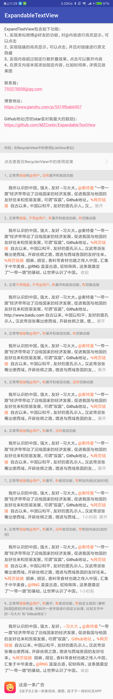

# ExpandableTextView
 **实现类似微博内容，@用户，链接高亮，@用户和链接可点击跳转，可展开和收回的TextView。觉得好用别忘了star哦，你的star是对我最大的激励**

### 更新日志
+ 2018-09-20 16:31:13 更新
    + 一、提供了在RecyclerView中使用的时候，对之前状态的保存的功能支持；
    + 二、新增对@用户和链接的处理，用户可以设置不对这些内容进行识别，仅仅使用展开和收回功能；
    + 三、优化的demo的效果，请大家重新下载apk进行体验。
    + 四、如果你没有设置对链接的监听，会默认调用系统浏览器打开链接
    + 五、最新版请使用v1.3


+ 2018-09-03 17:39:56 修复一些bug，链接sheSpan位置错误，未生成release，等待下次修复其他bug一起打tag依赖包，使用请本地依赖使用

+ 2018-08-31 17:31:56 优化设置padding对宽度造成的影响，依赖请使用tag版本v1.2

+ 2018-08-31 11:21:22 在V1.0的基础上进行了优化，依赖请使用tag版本v1.1

### 实现效果：

 

#### 下面是RecyclerView中的样式，可以保留之前展开和收回的状态

 

### 使用方式：

#### Step 1. Add the JitPack repository to your build file

 Add it in your root build.gradle at the end of repositories:

 ```
 allprojects {
 		repositories {
 			...
 			maven { url 'https://jitpack.io' }
 		}
 	}
 ```

#### Step 2. Add the dependency

 ```
 dependencies {
 	        implementation 'com.github.MZCretin:ExpandableTextView:v1.3'
 	}
 ```

### demo下载

[Demo下载](https://raw.githubusercontent.com/MZCretin/ExpandableTextView/master/extra/demo.apk)

扫描二维码下载：


### 代码说明

+ 以下属性都可以在xml中设置
```xml
        <!--保留的行数-->
        <attr name="ep_max_line" format="integer" />
        <!--是否需要展开-->
        <attr name="ep_need_expand" format="boolean" />
        <!--是否需要收起 这个是建立在开启展开的基础上的-->
        <attr name="ep_need_contract" format="boolean" />
        <!--是否需要动画-->
        <attr name="ep_need_animation" format="boolean" />
        <!--收起的文案-->
        <attr name="ep_contract_text" format="string" />
        <!--展开的文案-->
        <attr name="ep_expand_text" format="string" />
        <!--展开的文字的颜色-->
        <attr name="ep_expand_color" format="color" />
        <!--收起的文字的颜色-->
        <attr name="ep_contract_color" format="color" />
        <!--在收回和展开前面添加的内容的字体颜色-->
        <attr name="ep_end_color" format="color" />
        <!--链接的文字的颜色-->
        <attr name="ep_link_color" format="color" />
        <!--链接的图标-->
        <attr name="ep_link_res" format="reference" />

        //布局文件中使用 可选 也可以在代码中设置
        <com.ctetin.expandabletextviewlibrary.ExpandableTextView
                    android:id="@+id/ep_01"
                    android:layout_width="fill_parent"
                    android:layout_height="wrap_content"
                    android:layout_margin="15dp"
                    android:lineSpacingExtra="4dp"
                    android:textSize="14sp"
                    <!--开始展开的行数 -->
                    app:ep_max_line="4"
                    <!--是否需要对链接进行识别-->
                    app:ep_need_link="true"
                    <!--是否需要对@用户进行识别-->
                    app:ep_need_mention="true"
                    <!--是否需要收回功能-->
                    app:ep_need_contract="true"
                    <!--是否需要展开和收回的动画-->
                    app:ep_need_animation="true"
                    <!--展开文字的颜色-->
                    app:ep_expand_color="@color/colorAccent"
                    <!--收回的文字描述-->
                    app:ep_contract_text="收回"
                    <!--在展开前可添加tips tips的文字颜色-->
                    app:ep_end_color="@color/colorAccent"
                    <!--展开的文字描述-->
                    app:ep_expand_text="展开"
                    <!--被识别出来的链接的颜色-->
                    app:ep_link_color="@color/colorAccent"
                    <!--被识别出来的链接的前面的图标资源-->
                    app:ep_link_res="@color/colorAccent"
                    <!--展开的文字的颜色-->
                    app:ep_contract_color="@color/colorAccent"
                    <!--是否需要展开功能-->
                    app:ep_need_expand="false" />
```

+ java代码
```java
        /**
        *   正常的使用
        */
        ExpandableTextView expandableTextView = findViewById(R.id.ep_01);
        //需要显示的内容
        String yourText = "  我所认识的中国，强大、友好。@奥特曼 “一带一路”经济带带动了沿线国家的经济发展，促进我国与他国的友好往来和贸易发展，可谓“双赢”。http://www.baidu.com 自古以来，中国以和平、友好的面孔示人。汉武帝派张骞出使西域，开辟丝绸之路，增进与西域各国的友好往来。http://www.baidu.com 胡麻、胡豆、香料等食材也随之传入中国，汇集于中华美食。@RNG 漠漠古道，驼铃阵阵，这条路奠定了“一带一路”的基础，让世界认识了中国。";
        //将内容设置给控件
        expandableTextView.setContent(yourText);
        //xml中的属性也可以通过代码设置 比如
        expandableTextView.setmNeedExpend(true);
        //还有很多。。。。
        //添加点击监听
        expandableTextView.setLinkClickListener(new ExpandableTextView.OnLinkClickListener() {
            @Override
            public void onLinkClickListener(ExpandableTextView.LinkType linkType, String content) {
                //根据类型去判断
                if (linkType.equals(ExpandableTextView.LinkType.LINK_TYPE)) {
                    Toast.makeText(MainActivity.this, "你点击了链接 内容是：" + content, Toast.LENGTH_SHORT).show();
                } else if (linkType.equals(ExpandableTextView.LinkType.MENTION_TYPE)) {
                    Toast.makeText(MainActivity.this, "你点击了@用户 内容是：" + content, Toast.LENGTH_SHORT).show();
                }
            }
        });
```

### 新特性额外说明
如果你希望在RecyclerView(或者ListView)中使用，请认真阅读demo中在RecyclerView中的使用，细节都在注释中。

如果你需要在列表中保留之前的展开或收回状态，特殊说明的有以下几点：
+ 一、实现 ExpandableStatusFix
* 二、在你的model中定义一个 private StatusType status;
* 三、实现对应的方法，将你刚刚定义的status返回，
* 四、并在给ExpandableTextView设置内容之前，调用bind方法


### 实现思路讲解

**简书：** [【需求解决系列之三】Android 自定义可展开收回的ExpandableTextView](https://www.jianshu.com/p/5519fbab6907)

**掘金：** [【需求解决系列之三】Android 自定义可展开收回的ExpandableTextView](https://juejin.im/post/5b876a4de51d4571c5137660)
